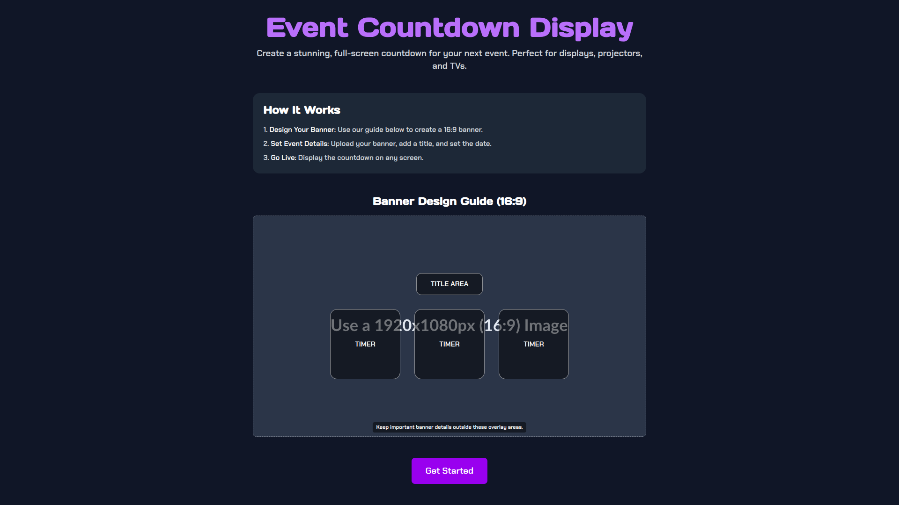
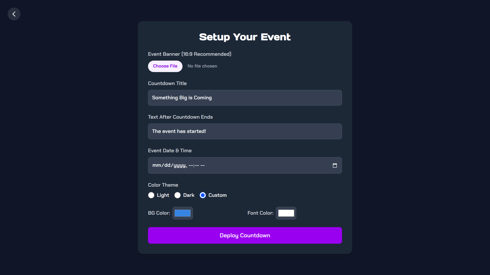
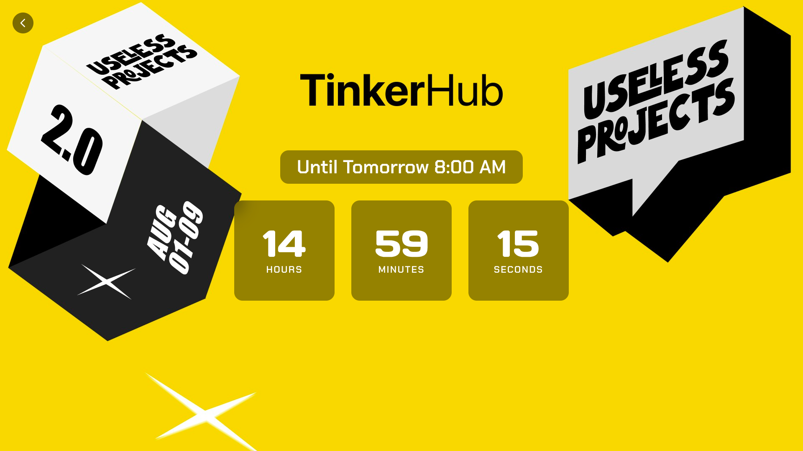
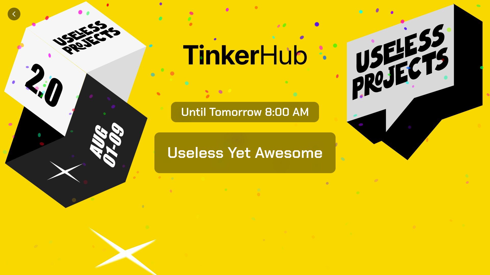
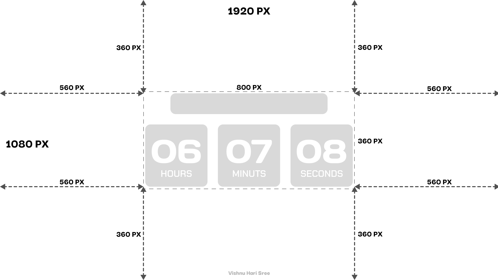

# Count It Down ⏱️

A sleek, customizable, full-screen countdown timer designed for events, product launches, and livestreams. Perfect for displaying on projectors, TVs, or any large screen.

---

### **Screenshots**

| Landing Page | Setup Form |
| :---: | :---: |
|  |  |
| **Live Countdown** | **Time Up** |
|  |  |

---

## **Purpose**

The goal of **Count It Down** is to provide a visually appealing and highly customizable countdown experience that can be set up in seconds. It solves the need for a dedicated, browser-based display for events without requiring complex software.

---

## **Features**

* **Full-Screen Display:** Designed to look great on large screens.
* **Smart Image Cropping:** Upload any image, and it will be automatically cropped to a 16:9 aspect ratio to fit the background.
* **Customizable Themes:**
    * **Light & Dark:** Two beautiful pre-built themes.
    * **Fully Custom:** Choose your own background and font colors for a branded experience.
* **Frosted Glass UI:** A modern, semi-transparent interface that ensures text is readable over any background.
* **The Grand Finale:** When the timer hits zero, it displays a custom message and a fun confetti animation.
* **No Installation Needed:** Runs entirely in the browser.

---

## **Banner Design Guide**

For the best results, use a high-resolution image. While the app automatically crops your banner to a **16:9 aspect ratio**, it's important to keep key visual elements away from the center where the timer will be displayed.

---

## **How to Use (No Setup Required)**

1.  **Open the Hosted Link:** Navigate to the live demo link provided above.
2.  **Upload Your Banner:** On the setup page, upload a background image for your event.
3.  **Set the Details:**
    * Add a title for your countdown.
    * Set the event's date and time.
    * Choose a color theme (Light, Dark, or Custom).
4.  **Deploy:** Click "Deploy Countdown" and you're ready to go!

---

## **Setup for Developers (Single File Version)**

This project is a self-contained `index.html` file that uses React and Tailwind CSS via CDNs. No complex setup is needed.

1.  **Download the Code:** Download the `index.html` file from this repository.
2.  **Open in Browser:** Open the `index.html` file directly in any modern web browser (like Chrome, Firefox, or Edge).
3.  **That's it!** The application will run locally.

---

## **Connect with Me**

* **LinkedIn:** [**Vishnu Hari Sree**](https://www.linkedin.com/in/vishnuharisree/)